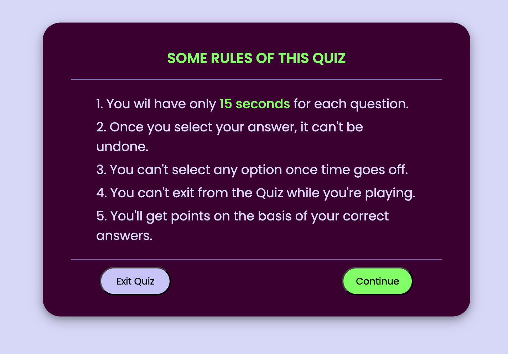
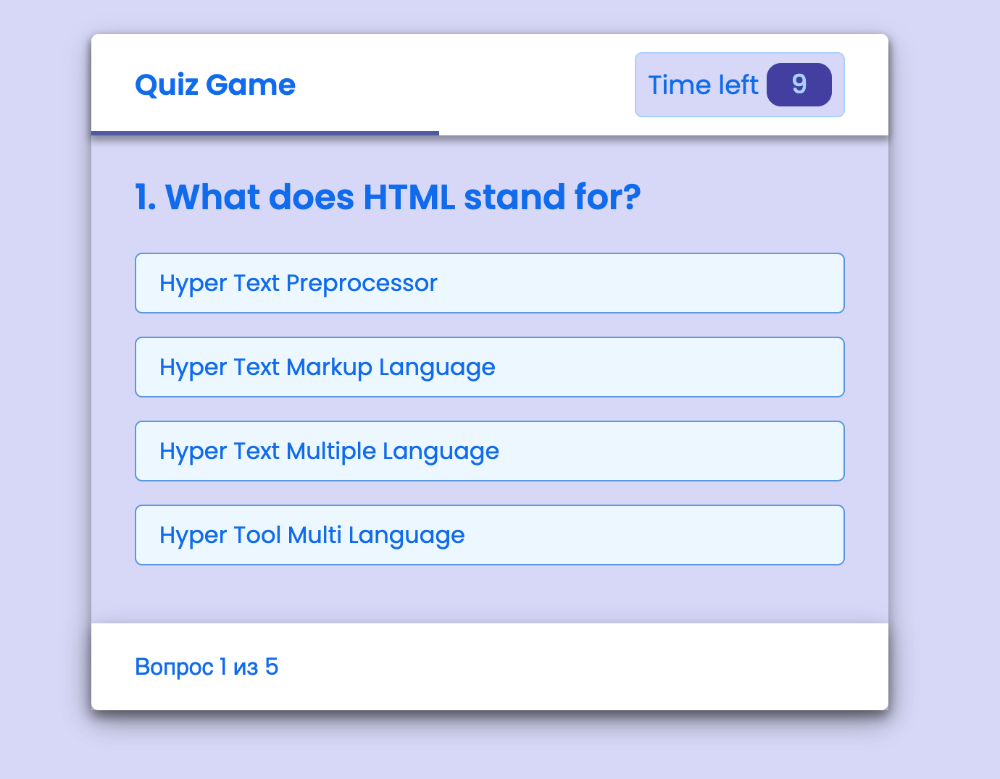

# 🧠 JavaScript Quiz App

A simple interactive quiz built with JavaScript and a countdown timer. The user answers one question at a time, and each question has a time limit. Perfect as a beginner-friendly practice project.

## 🚀 Features

- One question displayed at a time
- "Continue" button to start the quiz
- "Next Question" button to proceed
- 15-second timer per question
- Timer stops when time is up
- Timer resets for each new question

## 🛠️ Technologies Used

- **HTML** – structure
- **CSS ** – styling and responsiveness
- **JavaScript** – app logic, timer, question navigation

## 📸 Screenshots

## ✨ Possible Improvements

- Score calculation and result summary
- Show correct answer after each question
- Timer progress bar
- Smooth animations
- Save high scores in `localStorage`

## 📚 Learning Goals

This project helps you practice:

- DOM manipulation
- Using `setInterval` and `clearInterval`
- Organizing JS logic and event handling
- Basic UI/UX implementation
